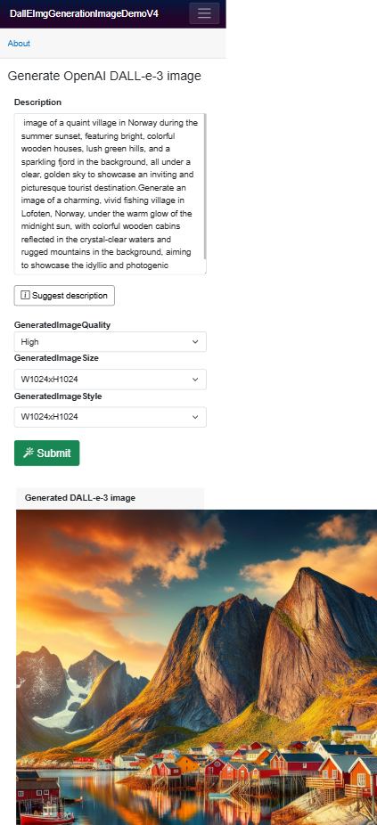

## Dall-E-3 Image Generation Demo

This Blazor app demonstrates using the DALL-e-3 image service from Open AI.	(using Open AI services)

It also suggests texts using Open AI Chat GPT that for the description of the image to create.
This uses the Chat GPT-4 service from Azure.

A screenshot depicts the app in use:

The app provides several helper methods and extension methods to create DALL-e-3 images and chat GPT-4
responses. You just have to set up the endpoint and api keys in the `appsettings.json` file to the 
accounts set up using the mentioned services to start using the app.

- To set up Azure AI services, use the Azure portal
https://portal.azure.com 

- To set up Azure OpenAI, log in to OpenAI:
https://auth.openai.com/log-in  

This demo is licensed under MIT license. In other words, use it freely.

_Last update:_
`09.03.2025`

## Tore Aurstad IT